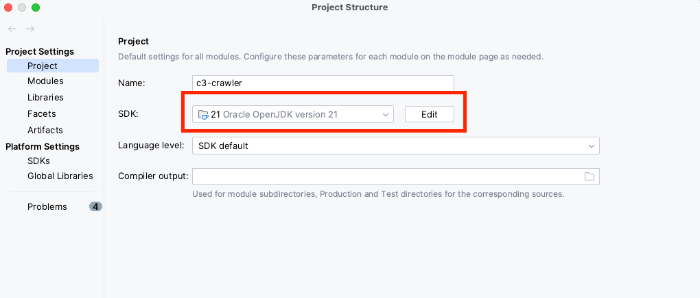
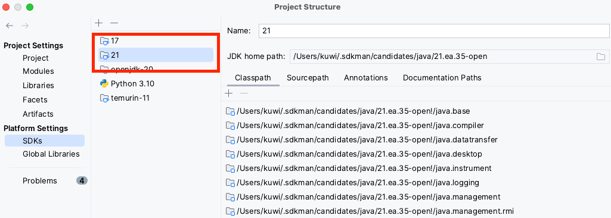

# Abstract

🥳 [Java v21 is out](https://openjdk.org/projects/jdk/21/). 🥳 Need to play... now!

# Tools

## SDKman!

```shell
curl -s "https://get.sdkman.io" | bash
```

## JDK

```shell
sdk install java 21.ea.35-open
sdk use java 21.ea.35-open
```

## Maven

```shell
sdk install maven 3.9.4
```

## VisualVM

```shell
sdk install visualvm 2.1.6
```

# Build

```shell
mvn clean package
```

# Run

```shell
java -jar target/crawler-jar-with-dependencies.jar 

```

# Intellij Config

Unter "Project Structure" (CMD+Ü) muss noch die SDK 21 in Intellij konfiguriert werden.



Sollte die SDK 21 hier noch nicht zu finden sein muss sie unter "Plattform Settings" -> "SDK's" hinzugefügt werden.
Tipp: solltest du die SDK vorher mit SDKman heruntergeladen haben, sollte Intellij sie im unteren Bereich des Auswahldialogs
automatisch finden. 



